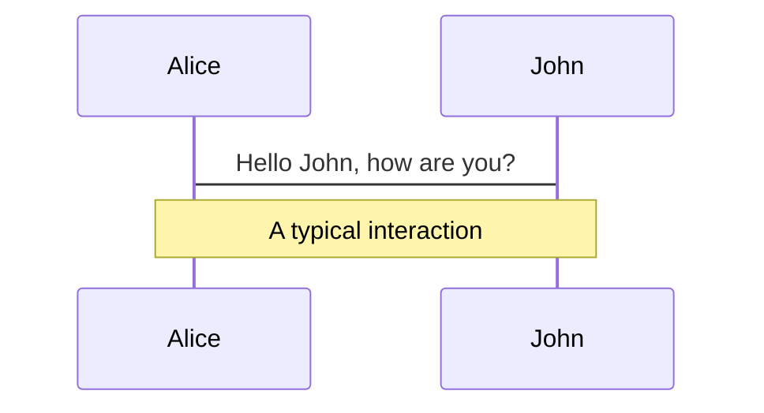
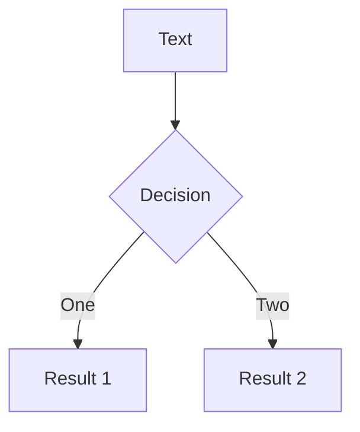

# Welcome to Slidev

Presentation slides for developers

<div class="pt-12">
  <span @click="$slidev.nav.next" class="px-2 py-1 rounded cursor-pointer" hover="bg-white bg-opacity-10">
    Press Space for next page <carbon:arrow-right class="inline"/>
  </span>
</div>

<div class="abs-br m-6 flex gap-2">
  <button @click="$slidev.nav.openInEditor()" title="Open in Editor" class="text-xl icon-btn opacity-50 !border-none !hover:text-white">
    <carbon:edit />
  </button>
  <a href="https://github.com/slidevjs/slidev" target="_blank" alt="GitHub"
    class="text-xl icon-btn opacity-50 !border-none !hover:text-white">
    <carbon-logo-github />
  </a>
</div>

<!--
The last comment block of each slide will be treated as slide notes. It will be visible and editable in Presenter Mode along with the slide. [Read more in the docs](https://sli.dev/guide/syntax.html#notes)
-->

---

# summary_text

-  The Rococo style began in France in the 1730s as a reaction against the more formal and geometric Style Louis XIV . It soon spread to other parts of Europe, particularly northern Italy, Austria, southern Germany, Central Europe and Russia . The term rococo was first used in print in 1825 to describe decoration which was "out of style and old-fashioned"
- Rocaille style, or French Rococo, appeared in Paris during the reign of Louis XV, and flourished between about 1723 and 1759 . Main ornaments of Rococo are: asymmetrical shells, acanthus and other leaves, birds, bouquets of flowers, fruits, musical instruments, angels and Chinoiserie (pagodas, dragons, monkeys, bizarre flowers and Chinese people) The style integrated painting, molded stucco, and wood carving, and quadratura, or illusionist ceiling paintings .
- Rococo decorative style reached its summit in southern Germany and Austria from the 1730s until the 1770s . Notable decorative painters included Giovanni Battista Tiepolo, who painted ceilings and murals of both churches and palazzos . The Venetian Rococo also featured exceptional glassware, particularly Murano glass, often engraved and coloured, which was exported across Europe .

---

# summary_text

-  In Great Britain, rococo was called the "French taste" and had less influence on design and the decorative arts than in continental Europe . William Hogarth helped develop a theoretical foundation for Rococo beauty . Mahogany made its appearance in England in about 1720, and became popular for furniture, along with walnut wood .
- The ornamental style called rocaille emerged in France between 1710 and 1750, mostly during the regency and reign of Louis XV . Its principal characteristics were picturesque detail, curves and counter-curves, asymmetry, and a theatrical exuberance . By 1785, Rococo had passed out of fashion in France, replaced by the order and seriousness of Neoclassical artists like Jacques-Louis David .
- Craftsmen in Rome, Milan and Venice all produced lavishly decorated furniture and decorative items . The most extravagant rocaille forms were found in the consoles, tables designed to stand against walls . The period also saw the arrival of Chinoiserie, often in the form of lacquered and gilded commodes .

---

# summary_text

-  The most elaborate examples of rococo sculpture were found in Spain, Austria and southern Germany, in the decoration of palaces and churches . A new form of small-scale sculpture appeared, the porcelain figure, or small group of figures, initially replacing sugar sculptures on grand dining room tables, but soon popular for mantelpieces and furniture .
- Rococo period existed in music history, although it is not as well known as the earlier Baroque and later Classical forms . Rococo fashion was based on extravagance, elegance, refinement and decoration . In the second half of the 18th century, a reaction against the Rococo style occurred . Led by Christoph Willibald Gluck, this reaction ushered in the Classical era .
- After the death of Louis XIV the clothing styles began to change . The fashion took a turn to a lighter, more frivolous style, transitioning from the baroque period to the well-known style of Rococo . The later period was known for their pastel colours, more revealing frocks and the plethora of frills, ruffles, bows, and lace as trims .

---

# Header

- The rococo style began in the 1730s as a reaction against the more formal and geometric style Louis xiv. the term rocaille was first used in print in 1825 to describe decoration which was" out of style and old- fashioned" since the mid-19th century, the term has been accepted by art historians.
- The rocaille style, or french rococo, appeared in Paris during the reign of Louis Xv. it flourished between about 1723 and 1759, and was used particularly in salons.
- The furniture featured sinuous curves and vegetal designs.
- The venetian rococo style is deeply anchored in popular culture.
- It is characterized by a light- filled weightlessness, festive cheerfulness and movement.
- The style reached its peak in southern Germany and Austria from the 1730s until the 1770s.
- François De Cuvilliés was one of the first to create a rococo building in Germany.
- The pavilion of amalienburg in Munich was inspired by the pavilions of the trianon and marly.
- A number of notable pilgrimage churches were constructed in the 1740s and 1750s.

---

# Header

-  Before entering the rococo, british furniture for a time followed the neoclassical palladian model under designer William Kent.
- The furniture of Thomas chippendale was the closest to the style.
- Rocaille emerged in France between 1710 and 1750, mostly during the regency and reign of Louis Xv. The best known french furniture designer of the period was Juste- aurèle meissonnier( 1695– 1750) his work is well known today because of the enormous number of engravings made of his work.
- The rocaille style flourished in Rome, Milan and Venice.
- The most extravagant rocaille forms were found in the consoles.
- chinoiserie, or chests, first appeared under Louis Xiv. François Boucher( 1703– 1770) was the favorite painter of Madame De Pompadour.
- He painted the sensual toilette De Venus( 1746) which became one of the best known examples.
- Other important painters of the style included François Lemoyne and François Lancret.
- The most elaborate examples of rococo sculpture were found in Spain, Austria and southern Germany.

---

# Header

-  A rococo period existed in music history, although it is not as well known as the earlier baroque and later classical forms.
- In the second half of the 18th century, a reaction against the style occurred, primarily against its perceived overuse of ornamentation and decoration.
- The style was based on extravagance, elegance, refinement and decoration.
- After the death of Louis Xiv the fashion took a turn to a lighter, more frivolous style.
- The later period was known for their pastel colours, more revealing frocks.
-' pannier' and' Mantua' became fashionable around 1718.
- Accessories were also important to all women during this period.

---

# What is Slidev?

Slidev is a slides maker and presenter designed for developers, consist of the following features

- 📝 **Text-based** - focus on the content with Markdown, and then style them later
- 🎨 **Themable** - theme can be shared and used with npm packages
- 🧑‍💻 **Developer Friendly** - code highlighting, live coding with autocompletion
- 🤹 **Interactive** - embedding Vue components to enhance your expressions
- 🎥 **Recording** - built-in recording and camera view
- 📤 **Portable** - export into PDF, PNGs, or even a hostable SPA
- 🛠 **Hackable** - anything possible on a webpage

<br>
<br>

Read more about [Why Slidev?](https://sli.dev/guide/why)

<!--
You can have `style` tag in markdown to override the style for the current page.
Learn more: https://sli.dev/guide/syntax#embedded-styles
-->

<style>
h1 {
  background-color: #2B90B6;
  background-image: linear-gradient(45deg, #4EC5D4 10%, #146b8c 20%);
  background-size: 100%;
  -webkit-background-clip: text;
  -moz-background-clip: text;
  -webkit-text-fill-color: transparent;
  -moz-text-fill-color: transparent;
}
</style>

---

# Navigation

Hover on the bottom-left corner to see the navigation's controls panel, [learn more](https://sli.dev/guide/navigation.html)

### Keyboard Shortcuts

|     |     |
| --- | --- |
| <kbd>right</kbd> / <kbd>space</kbd>| next animation or slide |
| <kbd>left</kbd>  / <kbd>shift</kbd><kbd>space</kbd> | previous animation or slide |
| <kbd>up</kbd> | previous slide |
| <kbd>down</kbd> | next slide |

<!-- https://sli.dev/guide/animations.html#click-animations -->

<p v-after class="absolute bottom-23 left-45 opacity-30 transform -rotate-10">Here!</p>

---
layout: image-right
image: https://source.unsplash.com/collection/94734566/1920x1080
---

# Code

Use code snippets and get the highlighting directly![^1]

```ts {all|2|1-6|9|all}
interface User {
  id: number
  firstName: string
  lastName: string
  role: string
}

function updateUser(id: number, update: User) {
  const user = getUser(id)
  const newUser = {...user, ...update}
  saveUser(id, newUser)
}
```

<arrow v-click="3" x1="400" y1="420" x2="230" y2="330" color="#564" width="3" arrowSize="1" />

[^1]: [Learn More](https://sli.dev/guide/syntax.html#line-highlighting)

<style>
.footnotes-sep {
  @apply mt-20 opacity-10;
}
.footnotes {
  @apply text-sm opacity-75;
}
.footnote-backref {
  display: none;
}
</style>

---

# Components

<div grid="~ cols-2 gap-4">
<div>

You can use Vue components directly inside your slides.

We have provided a few built-in components like `<Tweet/>` and `<Youtube/>` that you can use directly. And adding your custom components is also super easy.

```html
<Counter :count="10" />
```

<!-- ./components/Counter.vue -->
<Counter :count="10" m="t-4" />

Check out [the guides](https://sli.dev/builtin/components.html) for more.

</div>
<div>

```html
<Tweet id="1390115482657726468" />
```

<Tweet id="1390115482657726468" scale="0.65" />

</div>
</div>


---
class: px-20
---

# Themes

Slidev comes with powerful theming support. Themes can provide styles, layouts, components, or even configurations for tools. Switching between themes by just **one edit** in your frontmatter:

<div grid="~ cols-2 gap-2" m="-t-2">

```yaml
---
theme: default
---
```

```yaml
---
theme: seriph
---
```


</div>

Read more about [How to use a theme](https://sli.dev/themes/use.html) and
check out the [Awesome Themes Gallery](https://sli.dev/themes/gallery.html).

---
preload: false
---

# Animations

Animations are powered by [@vueuse/motion](https://motion.vueuse.org/).

```html
<div
  v-motion
  :initial="{ x: -80 }"
  :enter="{ x: 0 }">
  Slidev
</div>
```

<div class="w-60 relative mt-6">
  <div class="relative w-40 h-40">
    
    
    
  </div>

  <div
    class="text-5xl absolute top-14 left-40 text-[#2B90B6] -z-1"
    v-motion
    :initial="{ x: -80, opacity: 0}"
    :enter="{ x: 0, opacity: 1, transition: { delay: 2000, duration: 1000 } }">
    Slidev
  </div>
</div>

<!-- vue script setup scripts can be directly used in markdown, and will only affects current page -->
<script setup lang="ts">
const final = {
  x: 0,
  y: 0,
  rotate: 0,
  scale: 1,
  transition: {
    type: 'spring',
    damping: 10,
    stiffness: 20,
    mass: 2
  }
}
</script>

<div
  v-motion
  :initial="{ x:35, y: 40, opacity: 0}"
  :enter="{ y: 0, opacity: 1, transition: { delay: 3500 } }">

[Learn More](https://sli.dev/guide/animations.html#motion)

</div>

---

# LaTeX

LaTeX is supported out-of-box powered by [KaTeX](https://katex.org/).

<br>

Inline $\sqrt{3x-1}+(1+x)^2$

Block
$$
\begin{array}{c}

\nabla \times \vec{\mathbf{B}} -\, \frac1c\, \frac{\partial\vec{\mathbf{E}}}{\partial t} &
= \frac{4\pi}{c}\vec{\mathbf{j}}    \nabla \cdot \vec{\mathbf{E}} & = 4 \pi \rho \\

\nabla \times \vec{\mathbf{E}}\, +\, \frac1c\, \frac{\partial\vec{\mathbf{B}}}{\partial t} & = \vec{\mathbf{0}} \\

\nabla \cdot \vec{\mathbf{B}} & = 0

\end{array}
$$

<br>

[Learn more](https://sli.dev/guide/syntax#latex)

---

# Diagrams

You can create diagrams / graphs from textual descriptions, directly in your Markdown.

<div class="grid grid-cols-2 gap-10 pt-4 -mb-6">





</div>

[Learn More](https://sli.dev/guide/syntax.html#diagrams)


---
layout: center
class: text-center
---

# Learn More

[Documentations](https://sli.dev) · [GitHub](https://github.com/slidevjs/slidev) · [Showcases](https://sli.dev/showcases.html)
